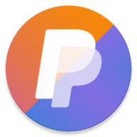
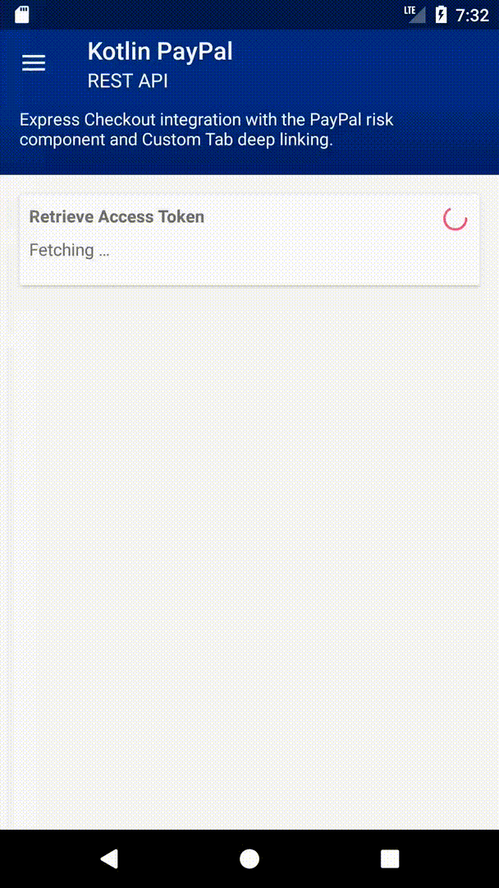
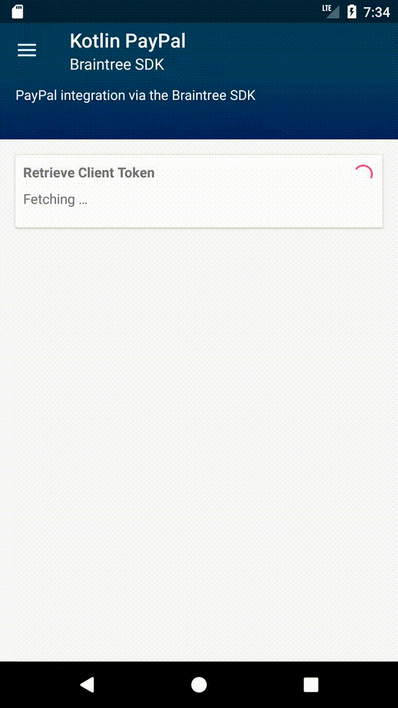

 

# Kotlin PayPal

A sample Kotlin app with two separate integrations of PayPal – one through the REST API, and one through the Braintree SDK.

### REST API

* Direct integration with the `/payments` [REST API](https://developer.paypal.com/docs/api/payments/)
* Displays the PayPal checkout in a Custom Tab, and deep links back to the sample app after payment authentication
* Includes an implementation of PayPal's risk component

 

### Braintree SDK
* Custom integration with PayPal through the [Braintree SDK](https://developers.braintreepayments.com/guides/paypal/client-side/android/v2)
* Basic server code included under `/server` for processing a simple transaction

 

## Libraries
This sample app makes use of several excellent open source libraries, including:
* [Conductor](https://github.com/bluelinelabs/Conductor)
* [Retrofit](https://github.com/square/retrofit)
* [Klaxon](https://github.com/cbeust/klaxon)
* (Full list available through the navigation drawer)
